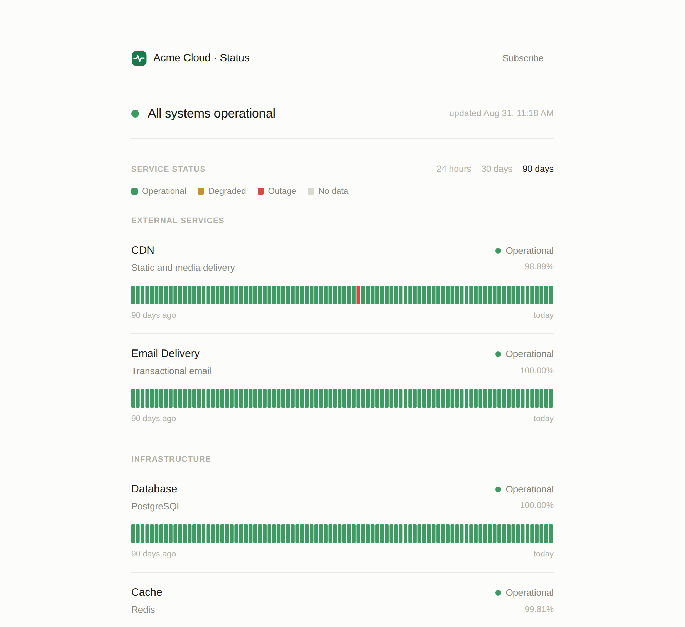
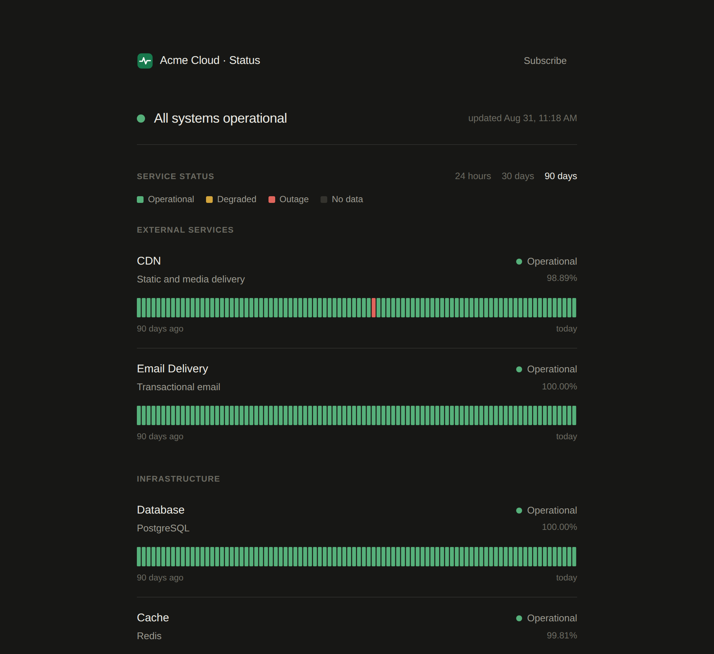
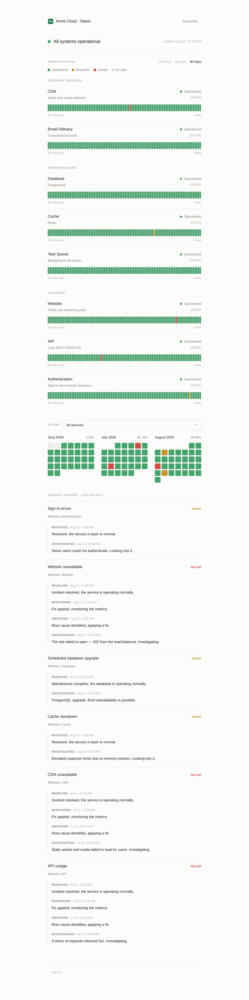

<div align="center">

# statuspage

**Автономная статус-страница, которую можно встроить в любой проект.**
Активные health-проверки, 90-дневная история аптайма, инциденты и плановые работы,
графики времени ответа и уведомления в Telegram — один небольшой FastAPI-сервис,
без SaaS и без зависимостей кроме БД.

[](https://github.com/ijwwsq/statuspage/actions/workflows/ci.yml)
[](LICENSE)
[](https://www.python.org/)
[](Dockerfile)

[English](README.md) · [Русский](README.ru.md)



</div>

---

## Зачем

Облачные статус-страницы — это подписка за то, что по сути является маленьким приложением:
пингануть пару URL, сохранить результат, нарисовать полоски и написать в чат, когда что-то
упало. **statuspage — это то самое маленькое приложение**: самодостаточное, встраиваемое
и целиком ваше.

- **Один сервис.** FastAPI + SQLAlchemy + Jinja + httpx. Ни Redis, ни Celery, ни сборки фронта.
- **Drop-in.** Все таблицы с префиксом `status_`, своя авторизация, своя БД, свой жизненный
  цикл. Копируете папку в проект — и она живёт сама по себе.
- **SQLite по умолчанию**, Postgres — когда нужно. Схема и индексы создаются на старте,
  миграции не требуются.
- **`docker compose up` → полностью наполненное демо** за секунды.

## Возможности

| | |
|---|---|
| **Активный монитор** | Фоновый цикл пингует `check_url` каждого компонента (HTTP **или** `tcp://host:port`), пишет пробы и считает аптайм по дням. |
| **Аптайм за 90 дней** | Полосы по компонентам с гранулярностью 24ч / 30д / 90д, помесячный календарь в стиле GitHub и графики времени ответа из реальных проверок. |
| **Авто-инциденты** | Заводит инцидент после N неудач подряд, закрывает после N восстановлений — с защитой от флапа и подавлением при плановых работах. |
| **Ручное управление** | Веб-админка (токен, CSRF, рейт-лимит логина): инциденты, плановые работы, ручные статусы компонентов. |
| **Детект замедления** | Медленный, но 200-й ответ помечается «Замедление» (жёлтый), а не сбоем — по порогу задержки. |
| **Telegram** | Подписка через бота; создание/обновление/закрытие инцидента уходит подписчикам. Полноценная админ-панель *внутри* чата — команды **и** инлайн-кнопки. |
| **Брендирование** | Имя, заголовок, акцентный цвет, лого, подвал — всё из `config.json` или env. |
| **Светлая и тёмная** | Тема следует за системной настройкой; брендовый акцент работает в обеих. |

## Скриншоты

Тёмная тема — по системной настройке пользователя:

<div align="center">

</div>

Вся страница — живой статус, 90-дневный календарь аптайма и полная история инцидентов:

<div align="center">

</div>

## Быстрый старт

### Демо одной командой

```bash
docker compose up
```

Откройте **<http://localhost:8090>** — статус-страница с 90 днями аптайма, пятью
историческими инцидентами и плановыми работами. Админка — **<http://localhost:8090/admin>**
(токен `demo123`).

### Локальный запуск

```bash
python -m venv .venv && source .venv/bin/activate
pip install -r requirements.txt
STATUS_ADMIN_TOKEN=secret uvicorn app.main:app --port 8090
```

Хотите демо-данные и локально?

```bash
STATUS_CONFIG_FILE=config.demo.json python seed_demo.py
```

## Конфигурация

**Компоненты и бренд** — в [`config.json`](config.json).
**Секреты и параметры** — из переменных окружения (см. [`.env.example`](.env.example)).

```jsonc
{
  "brand": {
    "name": "Acme Cloud · Status",
    "accent": "#18794D",                       // фирменный цвет, применяется по всей странице
    "logo": "/static/logo.svg"                 // ваш логотип в шапке (см. ниже)
  },
  "metrics": ["website", "api", "cdn"],        // у каких компонентов рисуются графики
  "components": [
    { "key": "website", "name": "Website", "group": "Platform",
      "check_url": "https://example.com", "expected_status": 200 },
    { "key": "database", "name": "Database", "group": "Infrastructure" }
    //  ^ без check_url → статус выставляется вручную из админки
  ]
}
```

### Логотип и брендинг

Укажите `brand.logo` — и картинка появится в шапке страницы:

- **Файл в комплекте** — положите `logo.svg` (или `.png`) в `app/static/` и задайте
  `"logo": "/static/logo.svg"` (в демо логотип подключён именно так).
- **Внешний URL** — `"logo": "https://…/logo.png"` тоже работает.
- `null` — показывать только название бренда.

`accent` перекрашивает страницу; `footer_note` добавляет строку в подвал; `support_url` и
`telegram_url` — ссылки в шапке/подвале. Всё это переопределяется и через env
(`STATUS_BRAND_NAME`, `STATUS_ACCENT`, `STATUS_BRAND_LOGO`, …).

Ключевые переменные окружения:

| Переменная | По умолчанию | Назначение |
|---|---|---|
| `STATUS_ADMIN_TOKEN` | `change-me` | Токен админки — **обязательно сменить в проде** |
| `STATUS_DATABASE_URL` | `sqlite:///./data/statuspage.db` | Файл SQLite или `postgresql+psycopg2://…` |
| `STATUS_CHECK_INTERVAL` | `60` | Интервал проверок, сек |
| `STATUS_HISTORY_DAYS` | `90` | Горизонт хранения проб |
| `STATUS_ALERT_AFTER` | `3` | Неудач подряд до авто-инцидента |
| `STATUS_RECOVER_AFTER` | `2` | Успехов подряд до авто-закрытия |
| `STATUS_DEGRADED_MS` | `1500` | 2xx медленнее порога → статус «Замедление» |
| `STATUS_TELEGRAM_BOT_TOKEN` | — | Включает Telegram-уведомления и бота |
| `STATUS_COOKIE_SECURE` | `false` | `true` за HTTPS |

Полный список с комментариями — [`.env.example`](.env.example).

## Как работает мониторинг

Каждые `STATUS_CHECK_INTERVAL` секунд монитор проверяет компоненты с `check_url`:

- **HTTP/S** — `GET` (или указанный метод); `ok`, когда код равен `expected_status`.
- **TCP** — `tcp://host:port`; `ok`, когда порт принимает соединение (БД, кэш, пулы).

Каждая проба сохраняется и питает полосы аптайма, календарь и графики задержек.
Компонент **без** `check_url` управляется только из админки — удобно для того, что дорого
пинговать. Ручной статус всегда перекрывает монитор.

## Telegram

Задайте `STATUS_TELEGRAM_BOT_TOKEN` и выберите способ доставки:

- **Long-poll** (публичный URL не нужен): `STATUS_TELEGRAM_POLL=true`.
- **Webhook**: настройте Telegram на `POST /telegram/webhook/<STATUS_TELEGRAM_WEBHOOK_SECRET>`.

Пользователь подписывается командой `/start`. Чаты из `STATUS_TELEGRAM_ADMIN_CHAT_IDS`
получают панель управления прямо в чате: `/status` рисует живую сводку с инлайн-кнопками
для смены статусов и закрытия инцидентов, плюс текстовые команды (`/incident`,
`/maintenance`, `/update`, `/resolve`, …).

## Заметки по деплою

- **Postgres в проде:** задайте `STATUS_DATABASE_URL` вида `postgresql+psycopg2://…` и
  добавьте `psycopg2-binary` в образ. Таблицы и индексы создаются идемпотентно на старте.
- **Один процесс:** монитор держит состояние защиты от флапа в памяти — запускайте **один**
  инстанс. Сервис задуман компактным и вертикальным, без горизонтального шардинга.
- **HTTPS:** выставьте `STATUS_COOKIE_SECURE=true`, чтобы куки админки были `Secure`.

## Архитектура

```
app/
  config.py        # env + config.json → Settings
  db.py            # движок (SQLite/Postgres), WAL-прагмы
  models.py        # таблицы status_*
  monitor.py       # активный health-checker + логика авто-инцидентов
  notify.py        # Telegram: уведомления, команды бота, инлайн-панель
  service.py       # сборка сводки + операции с инцидентами (+ чистые хелперы)
  cache.py         # кэш сводки с коротким TTL и ручной инвалидацией
  routes_public.py # витрина, /api/summary, вебхук Telegram
  routes_admin.py  # admin-API с токеном (CSRF, рейт-лимит)
  main.py          # сборка приложения + lifespan (монитор и поллер)
  templates/       # index.html, admin.html
  static/          # чистые ES-модули + один CSS, без сборки
config.json        # компоненты + бренд
config.demo.json   # самодостаточный демо-конфиг (для seed_demo.py)
seed_demo.py       # генерирует 90 дней показательных данных
```

## Тесты

```bash
pytest -q
```

Чистая логика (`day_status`, `overall`) и сервисные операции покрыты на in-memory SQLite —
без сети и внешних сервисов. CI гоняет тесты на Python 3.11 и 3.12 и smoke-поднимает
Docker-образ.

## Контрибьютинг

Issues и PR приветствуются — держим проект компактным. См. [CONTRIBUTING.md](CONTRIBUTING.md).

## Лицензия

[MIT](LICENSE) © ijwwsq
